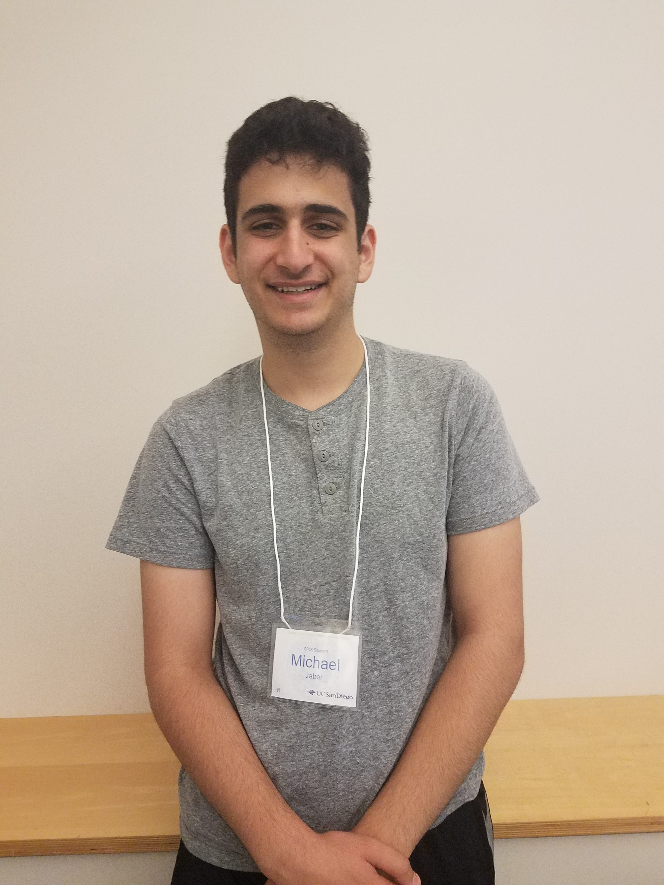

# practice-michael-j

My name is Michael Jaber and I am from San Ramon, California. My hopes for SPIS are to gain a solid foundation in computer science in order to ready for myself for the upcoming year. My goal is to learn as much as I can about computer science and its many applications in the real world. As for in my spare time, I enjoy hanging out with friends, cooking, playing video games, and simply browsing the internet. 

